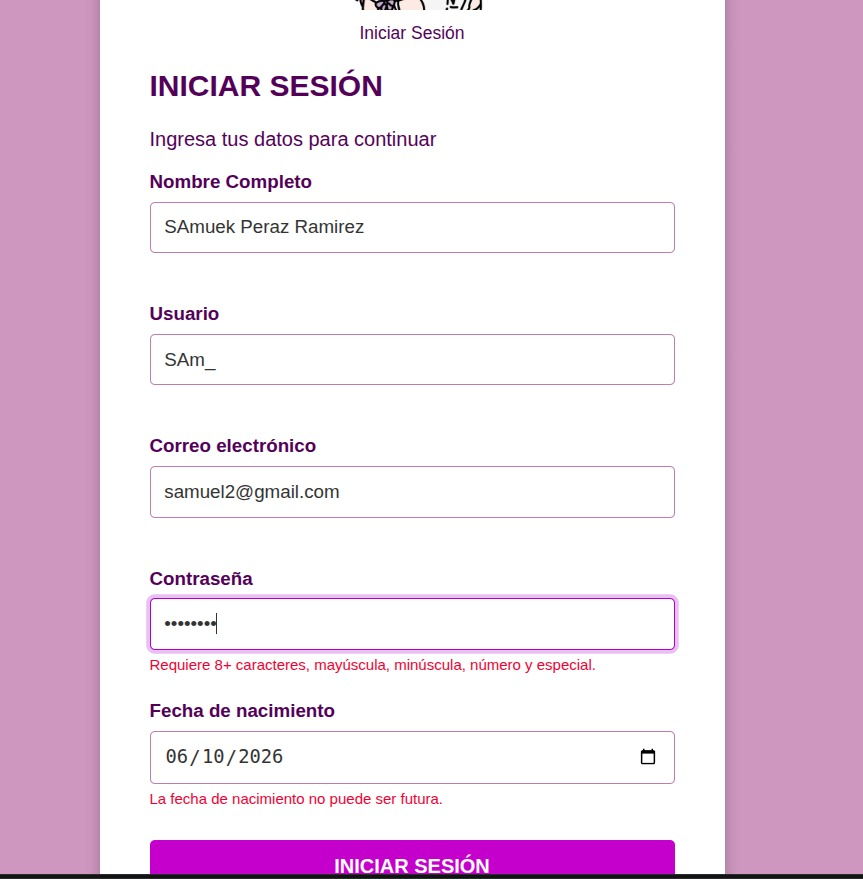
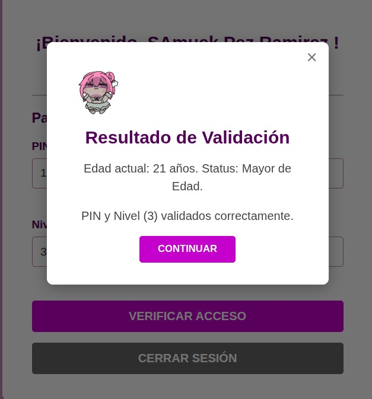

# Utilería JS (`utileria.js`)

## Portada
- **Nombre:** Librería de Utilidades de Validación y Cálculo (`utileria.js`)
- **Problema que resuelve:** En el desarrollo web, la validación de entradas de usuario (correo, contraseñas seguras, nombres de usuario) y el cálculo de fechas (como verificar la mayoría de edad) suelen generar duplicación de código e inconsistencias en la interfaz. Esta librería centraliza y estandariza las validaciones de formularios más comunes mediante funciones nativas, reutilizables y puras en JavaScript, evitando desbordamientos de datos y mejorando la experiencia de usuario.

---

## Instalación

Incluye el archivo `utileria.js` dentro de tu proyecto HTML vinculándolo antes de cerrar la etiqueta `</body>` o en la sección `<head>`:

# Utilería JS (`utileria.js`)

Librería liviana de utilidades en JavaScript diseñada para simplificar y estandarizar la validación de formularios y cálculos comunes en aplicaciones web. 

### ¿Qué problema resuelve?
Evita la duplicación de código al validar datos ingresados por usuarios (correos, contraseñas fuertes, formatos de texto, rangos) y simplifica operaciones recurrentes con fechas (cálculo de edad exacta y verificación de mayoría de edad), proporcionando funciones listas para usar, confiables y con soporte para caracteres en español (por que tiene la ñ)

---

## Instalación

Incluye el archivo `utileria.js` en tu proyecto e impórtalo en tu documento HTML antes de tus scripts principales:

```html
<script src="utileria.js"></script>
```

---

## Ejemplos de Uso

A continuación se muestra cómo integrar y ejecutar las funciones dentro de tu código JavaScript:

```javascript
// 1. Validar un correo electrónico
if (validarCorreo("usuario@dominio.com")) {
    console.log("El correo es válido");
}

// 2. Validar que un texto contenga solo letras y caracteres en español
console.log(soloLetras("María José")); // true
console.log(soloLetras("User123"));     // false

// 3. Validar la longitud de dígitos de un número o texto
console.log(validarLongitud(12345, 5)); // true
console.log(validarLongitud("123456", 5)); // false

// 4. Calcular la edad exacta a partir de una fecha de nacimiento
const edad = calcularEdad("2000-05-15");
console.log(`Edad: ${edad} años`);

// 5. Comprobar si una persona es mayor de edad
if (esMayorDeEdad("2005-10-20")) {
    console.log("Acceso permitido: Es mayor de edad.");
}

// 6. Validar fortaleza de contraseña
// (Mínimo 8 caracteres, al menos 1 mayúscula, 1 minúscula, 1 número y 1 carácter especial)
const esSegura = validarPassword("Pass1234!");
console.log(`¿Contraseña segura?: ${esSegura}`); // true

// 7. Verificar si un número está dentro de un rango
console.log(validarRango(15, 1, 10));  // false
console.log(validarRango(5, 1, 10));   // true

// 8. Validar nombre de usuario (4-20 caracteres alfanuméricos y guión bajo)
console.log(validarUsuario("coder_99")); // true
console.log(validarUsuario("a"));        // false
```

---

## Documentación de API

### `validarCorreo(correo)`
Valida si un texto cumple con la estructura estándar de correo electrónico.
* **Parámetros:**
  * `{string} correo` - Correo electrónico a evaluar.
* **Retorna:** `{boolean}` - `true` si es válido, de lo contrario `false`.

### `soloLetras(texto)`
Verifica que una cadena contenga únicamente letras y espacios. Admite caracteres en español (vocales con tilde, 'ñ' y diéresis).
* **Parámetros:**
  * `{string} texto` - Cadena de texto a evaluar.
* **Retorna:** `{boolean}` - `true` si contiene solo letras y espacios, de lo contrario `false`.

### `validarLongitud(numero, maxLongitud)`
Valida que la cantidad de dígitos o caracteres de un número/cadena no supere una longitud máxima.
* **Parámetros:**
  * `{number|string} numero` - Valor a evaluar.
  * `{number} maxLongitud` - Cantidad máxima permitida.
* **Retorna:** `{boolean}` - `true` si la longitud es menor o igual al límite, de lo contrario `false`.

### `calcularEdad(fechaNacimiento)`
Calcula la edad exacta en años cumplidos a partir de una fecha de nacimiento.
* **Parámetros:**
  * `{string|Date} fechaNacimiento` - Fecha de nacimiento en formato aceptado por `Date()` (ej. `"YYYY-MM-DD"`).
* **Retorna:** `{number}` - Edad calculada en años.

### `esMayorDeEdad(fechaNacimiento)`
Determina si una persona es mayor de edad (18 años o más) según su fecha de nacimiento.
* **Parámetros:**
  * `{string|Date} fechaNacimiento` - Fecha de nacimiento (ej. `"YYYY-MM-DD"`).
* **Retorna:** `{boolean}` - `true` si tiene 18 años o más, de lo contrario `false`.

### `validarPassword(password)`
Valida la fortaleza de una contraseña comprobando que cumpla con los criterios de seguridad mínimos:
* Mínimo 8 caracteres.
* Al menos una letra mayúscula (`A-Z`).
* Al menos una letra minúscula (`a-z`).
* Al menos un dígito numérico (`0-9`).
* Al menos un carácter especial (ej. `!@#$%^&*`).
* **Parámetros:**
  * `{string} password` - Contraseña a evaluar.
* **Retorna:** `{boolean}` - `true` si cumple con todos los criterios de seguridad, de lo contrario `false`.

### `validarRango(numero, minimo, maximo)`
Verifica si un número se encuentra dentro de un rango inclusivo (mínimo y máximo).
* **Parámetros:**
  * `{number} numero` - Número a evaluar.
  * `{number} minimo` - Límite inferior permitido.
  * `{number} maximo` - Límite superior permitido.
* **Retorna:** `{boolean}` - `true` si está dentro del rango, de lo contrario `false`.

### `validarUsuario(usuario)`
Valida el nombre de usuario según reglas de longitud y caracteres permitidos:
* Mínimo 4 caracteres, máximo 20.
* Permite únicamente letras (`A-Z`, `a-z`), números (`0-9`) y guion bajo (`_`).
* **Parámetros:**
  * `{string} usuario` - Nombre de usuario a evaluar.
* **Retorna:** `{boolean}` - `true` si cumple con el formato, de lo contrario `false`.


## Demostración y Capturas de Pantalla

A continuación se muestra el funcionamiento del sistema dividido entre las dos vistas principales, utilizando la librería `utileria.js`, eventos de JavaScript y almacenamiento local.

---

### 1. Formulario de Inicio de Sesión (`login.html`)



* **Descripción del Resultado:** 
  La vista del Login permite el ingreso de los datos iniciales del usuario (Nombre Completo, Usuario, Correo Electrónico, Contraseña y Fecha de Nacimiento). Si los datos ingresados no cumplen con las reglas, se despliegan mensajes de error dinámicos debajo de los campos afectados (por ejemplo, al ingresar un correo sin formato o una fecha inválida).

* **Funciones y Eventos Utilizados:**
  * **Evento `submit`:** Escucha el envío del formulario, detiene la recarga de página mediante `event.preventDefault()` y activa el flujo de validación.
  * **Librería (`utileria.js`):** Hace uso de las funciones `soloLetras()`, `validarUsuario()`, `validarCorreo()` y `validarPassword()`.
  * **Persistencia (`localStorage`):** Una vez que todas las validaciones son exitosas, los datos del usuario se empaquetan en un objeto de JavaScript y se almacenan permanentemente en el navegador utilizando `localStorage.setItem('usuarioData', JSON.stringify(datosUsuario))`. Posteriormente, redirige al usuario hacia `index.html`.

---

### 2. Panel de Verificación de Seguridad con Validaciones (`index.html`)


* **Descripción del Resultado:** 
  Al ingresar a esta vista, la interfaz saluda al usuario mostrando dinámicamente su nombre y correo guardados previamente. Contiene un formulario de seguridad secundaria que evalúa un PIN y un Nivel de Acceso. Si el usuario ingresa un PIN con más de 4 dígitos o un Nivel fuera del rango, se muestran alertas en color rojo.

* **Funciones y Eventos Utilizados:**
  * **Evento `DOMContentLoaded`:** Se ejecuta automáticamente al cargar el DOM. Lee los datos almacenados en `localStorage` usando `localStorage.getItem('usuarioData')`, los convierte de vuelta a un objeto con `JSON.parse()` y actualiza dinámicamente el texto del encabezado (`¡Bienvenido, ...!`). Si no existen datos guardados, redirige por seguridad al `login.html`.
  * **Evento `submit`:** Procesa la validación secundaria del formulario.
  * **Librería (`utileria.js`):** Evalúa los campos mediante las funciones `validarLongitud()` para el PIN y `validarRango()` para determinar que el nivel solicitado se encuentre entre 1 y 5.
  * **Evento `click` (Cerrar Sesión):** El botón "CERRAR SESIÓN" dispara una función que elimina los datos del navegador con `localStorage.removeItem('usuarioData')` y devuelve al usuario a la pantalla de login.

---

### 3. Modal de Resultado de Validación (`index.html`)



* **Descripción del Resultado:** 
  Cuando los datos del panel de verificación son válidos, se despliega una ventana modal con los resultados del procesamiento de la fecha de nacimiento ingresada en el primer formulario y la confirmación del acceso concedido.

* **Funciones y Eventos Utilizados:**
  * **Librería (`utileria.js`):** Se ejecutan las funciones `calcularEdad()`, la cual determina la edad exacta en años cumplidos recuperando la fecha de nacimiento almacenada en `localStorage`, y `esMayorDeEdad()`, que evalúa si la persona cuenta con 18 años o más para asignar el status correspondiente.
  * **Manipulación del DOM:** Se inserta el texto calculado en los elementos HTML `<p id="resultadoEdad">` y `<p id="resultadoVerificacion">`.
  * **Eventos `click` (Modal):** Se hace visible el modal modificando su propiedad de estilo CSS (`modal.style.display = 'flex'`). Adicionalmente, se configuran escuchadores de evento `click` sobre el botón "CONTINUAR", el ícono de cierre `×` y el objeto global `window` para ocultar la ventana cuando el usuario haga clic fuera de ella.


  **Enlace del video demostrativo**
  https://drive.google.com/file/d/1xUH_kAdJanQiLk3NSTD4H6gIEEjIk5_d/view?usp=drive_link
